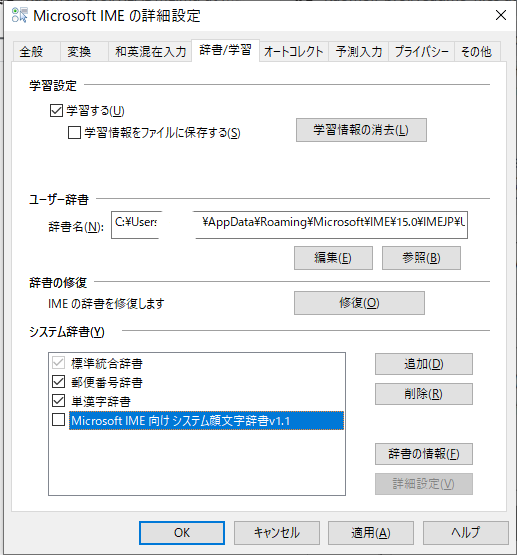
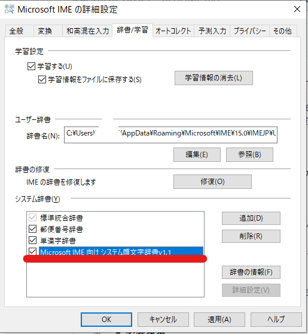

## Microsoft IMEへの設定方法

### 1.ダウンロード
本辞書をリポジトリからダウンロードしてください。
[こちら](https://github.com/mtripg6666tdr/Kaomoji_proj/releases/)のページを開き、最新版リリースの**kaomoji_sys.zip**をダウンロードします。

zipで圧縮されているので展開してください。（通常はエクスプローラーなどからファイルを右クリックし、展開を選択します。）

### 2.現在の入力方法をMicrosoft IMEに切り替えます
Windowsの右下の通知領域に、Microsoft IMEの「A」というアイコン（または「あ」というアイコン）があることを確認します。

#### 表示されていなければ以下の項目を確認してください。
- 入力可能状態にしてください。

インターネットのページのテキスト入力欄にカーソルを入れる等で入力可能状態にできます。
下のような×マークのようなアイコンが表示されているときは、入力可能状態になっていません。

- Windowsキーとスペースキーを押して入力方法を切り替えてください。

複数の入力方法が端末に登録されている場合、入力方法をMicrosoft IMEにしてください。
### 3.辞書を追加します
手順2で確認した、Microsoft IMEのアイコンを右クリックし、「追加辞書サービス(Y)」から「辞書の設定(S)」を選択します。

表示されたウインドウのしたにある、システム辞書の「追加」ボタンを押して、さきほどダウンロードしたdicファイルを選択してください。

#### ⚠重要：前回のバージョンが残っている場合には、その辞書を削除してから登録してください。前回のバージョンの辞書を選択して「削除」を選択します。
### 4.辞書を適用します
システム辞書の一覧に「Microsoft IME向けシステム顔文字辞書vX.X」が追加されていると思いますので、その項目にチェックをいれてください。

以上でウインドウの「OK」を押して終了となります。

さらに詳細な追加方法は[Microsoftのヘルプ](https://support.microsoft.com/ja-jp/help/4462244/microsoft-ime#section-8)もご覧ください。
