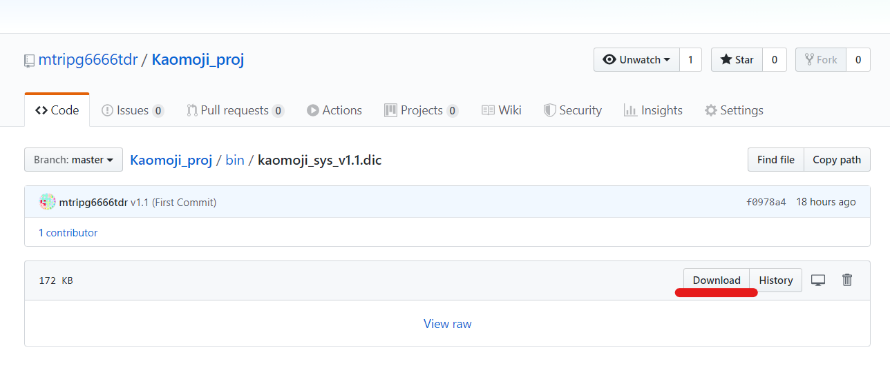
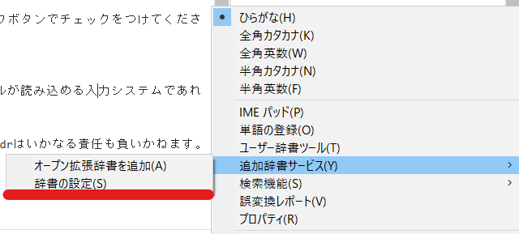
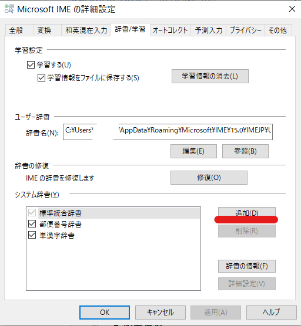
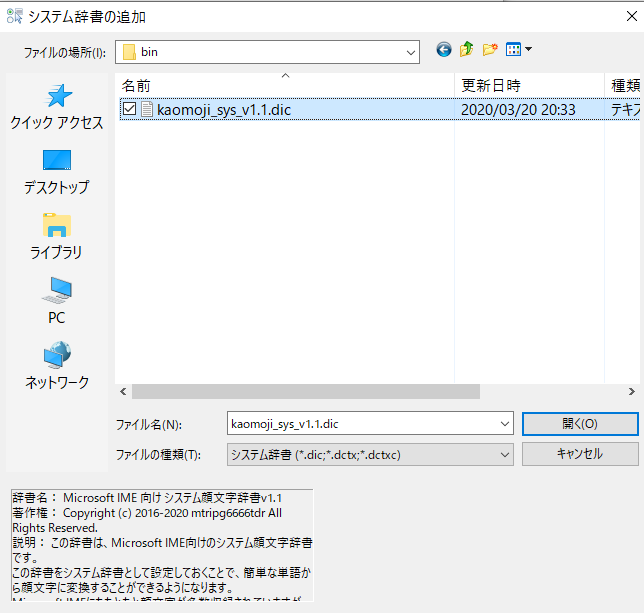
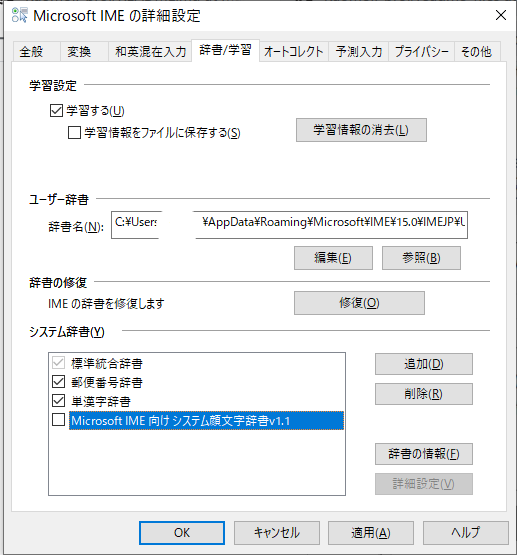
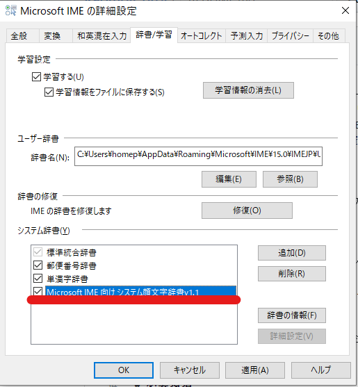

*このページの内容をよく読んでから使用してください

# Kaomoji_proj
 Kaomoji_projはMicrosoft社の入力ソフト、Microsoft IME向けの顔文字の辞書を作成するプロジェクトです。
# 目的
 Microsoft IMEにははじめから顔文字が多数収録されていますが、それでは物足りない人のためのカスタムユーザー辞書を提供することです。
 顔文字はmtripg6666tdrがネット上で見つけたものやそれらを組み合わせたものです。
# ライセンス
本リポジトリのコンテンツは[GNU General Public License v3.0](LICENSE.md)のもとで提供されます。
# バージョン
現在の本辞書の最新のバージョンはv1.3です。
それ以前の辞書を既に使用している場合には、削除してから登録し直してください。
# 使用法
本辞書はMicrosoft IMEに登録することで、誰でも使用できるようにます。
## 1.ダウンロード
本辞書をリポジトリからダウンロードしてください。
[こちら](bin/kaomoji_sys_v1.3.dic)のページを開き、右側にある、Downloadボタンによりダウンロードします。

## 2.現在の入力方法をMicrosoft IMEに切り替えます
Windowsの右下の通知領域に、Microsoft IMEの「A」というアイコン（または「あ」というアイコン）があることを確認します。

### 表示されていなければ以下の項目を確認してください。
- 入力可能状態にしてください。

インターネットのページのテキスト入力欄にカーソルを入れる等で入力可能状態にできます。
下のような×マークのようなアイコンが表示されているときは、入力可能状態になっていません。

- Windowsキーとスペースキーを押して入力方法を切り替えてください。

複数の入力方法が端末に登録されている場合、入力方法をMicrosoft IMEにしてください。
## 3.辞書を追加します
手順2で確認した、Microsoft IMEのアイコンを右クリックし、「追加辞書サービス(Y)」から「辞書の設定(S)」を選択します。

表示されたウインドウのしたにある、システム辞書の「追加」ボタンを押して、さきほどダウンロードしたdicファイルを選択してください。

### ⚠重要：前回のバージョンが残っている場合には、その辞書を削除してから登録してください。前回のバージョンの辞書を選択して「削除」を選択します。
## 4.辞書を適用します
システム辞書の一覧に「Microsoft IME向けシステム顔文字辞書vX.X」が追加されていると思うので、その項目のチェックボタンでチェックをつけてください。

以上でウインドウの「OK」を押して終了となります。

さらに詳細な追加方法は[Microsoftのヘルプ](https://support.microsoft.com/ja-jp/help/4462244/microsoft-ime#section-8)もご覧ください。
# 必要環境
 本辞書は拡張子dicのシステム辞書として提供されます。本辞書はMicrosoft IME向けに作られていますが、このファイルが読み込める入力システムであれば正常に動作する可能性があります。ただし、いかなる場合でも動作保証はいたしません。
# 免責事項
 本リポジトリのコンテンツにより、使用者の端末にいかなる損害・損失等が発生した場合でも、作成者の、mtripg6666tdrはいかなる責任も負いかねます。
 ご利用の際は、ご自身の端末に、あくまで自己責任の上でダウンロードおよびインストールしてください。
 ※本リポジトリのコンテンツはすべて無保証で提供されます。
# プロジェクトに参加する
 本プロジェクトはそこまでかたいものではなく、誰でも気軽に参加できます。
 特にグループもないので、追加して欲しい顔文字を気軽に申請してください。
## 参加方法
- 顔文字申請フォーム

 [こちら](https://forms.gle/xFHd98CTpJrs6cN68)の申請フォームから、顔文字の登録を匿名で申請できます。
 お気軽にご申請ください。
- Twitterにてツイート

下のTwitterアカウント宛にDMまたはメンションしていただいても構いません。
DMやメンションいただかなくても、ハッシュタグ[#kaomoji_proj](https://twitter.com/hashtag/kaomoji_proj)をつけてツイートしていただいても構いません。

[今すぐツイート](https://twitter.com/intent/tweet?text=&hashtags=kaomoji_proj&via=mtripg6666tdr)

 お気軽に申請ください。申請をお待ちしています。
# 作成者
[みょん ❲myon2019❳ / mtripg6666tdr](https://github.com/mtripg6666tdr)

[Twitter：@mtripg6666tdr](https://twitter.com/mtripg6666tdr)

[ホームページ：みっくすくらっぷ](https://scrpg.tyanoyu.net/?ref=github_kaomojiproj_readme)

Copyright (c) 2016-2020 mtripg6666tdr All Rights Reserved.
